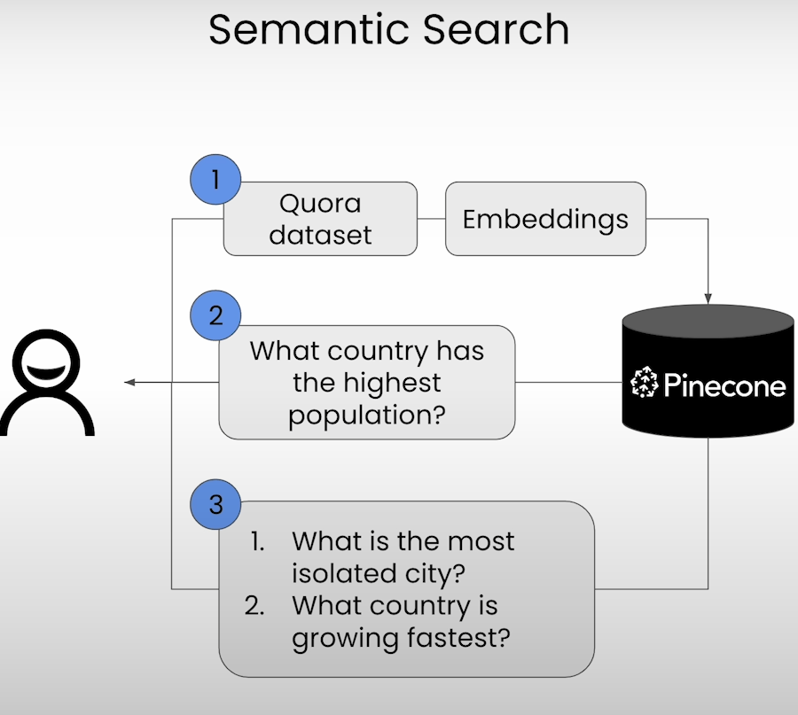

# Building Applications with Vector Databases

# Semantic Search

It is a type of search that focus on the meaning of the content being search rather than lexical search that look for literals. 

Pinecone is the [vector database](https://www.pinecone.io/learn/vector-database/) that helps power AI for the world’s [best companies](https://www.pinecone.io/customers/) and it will be the vector DB we will be using throughout this course.

## Architecture

We will be building a simple QA application.

- Load model
- Create Index on Pinecone
- Get query
- Return list of Top k closest embeddings (answers)

# Retrieval Augmented Generation (RAG)

Retrieval-Augmented Generation (RAG) is the process of optimizing the output of a large language model, so it references an authoritative knowledge base outside of its training data sources before generating a response.

## Architecture

We will be doing some prompt engineering. The main goal is obtain possible answers for our query and the use an LLM to obtain a summary/answer for the query.

- Load Data
- Create Embedding Index on Pinecone
    - Embedding model **text-embedding-ada-002** from openAI
    - Upload embeddings to Pipecone
- Get query from user
- Query pipecone for Top k closest embeddings (answers)
- Prompt Engineering
    - Use matches from pipecone as context and ask question to LLM using the provided context to obtain plausible answer.
- Return answer to user

# Recommender Systems

## Architecture

- Load Data (news articles titles and content)
- Create Embedding Index on Pinecone
    - Embedding model **text-embedding-ada-002** from openAI
    - Create embedding of Titles on batches
    - Upload batch to Pipecone
- Get query from user
- Query pipecone for Top k closest embeddings (answers)
- Return to user list of recommendations

# Hybrid Search

In short the idea is to mix Sparse and dense vectors on Pipecone to perform a search.

For this problems we will be working with Fashion (image) product database. We will be working with to algorithms

- BM25 for Sparse vectors
- CLIP for dense vectors. i.e. image recognition image → text.

**BM25** is a ranking function that is used to retrieve text by estimating the relative importance of terms in the text to the search query. It is calculated based on the number of documents in the data corpus and the word frequency across all relevant documents. 

**CLIP (Contrastive Language-Image Pre-Training)** is a neural network trained on a variety of (image, text) pairs. It maps an image to text/caption to describe the image.

## Architecture

- Load Data (news articles titles and content)
- Bm25 encode data
- Load model **sentence-transformers/clip-ViT-B-32**
- Create Embedding Index on Pinecone
    - Embedding model **text-embedding-ada-002** from openAI
    - Create embedding on batches
    - Upload batch to Pipecone
- Get query from user
- Query Pipecone for Top k closest embeddings (answers)
- Return List of images matching query

# Facial Similarity Search

Goal: Given a picture of a child determine which parent is more similar to the child.

**t-SNE Stochastic Neighbor Embedding** is a tool visualize a high dimensional data like our data of multiple image embeddings. It works by grouping similarities in the higher dimensional space. For more info see [https://www.pinecone.io/learn/dimensionality-reduction/](https://www.pinecone.io/learn/dimensionality-reduction/)

## Architecture

- Load Data (news articles titles and content)
- Create Embedding Index on Pinecone
- Apply PCA to visualize
- Use t-SNE plot.
    - t-SNE may be really slow. Hence applying PCA helps on performance and reduce cur of dimensionality curse
- Decide if child is more similar to dad or mom.
- Given that we know which parent is more similar. Find the image associated of the parent using similarity embedding

# Anomaly Detection System

Find anomaly entries on Cisco Log files

## Architecture

- Setup Pinecone
- Load data
- Define embedding model **bert-base-uncased** and model to be train
- Train model using **Labeled data**
- Create embedding and index on Pipecone
- Find anomalies

