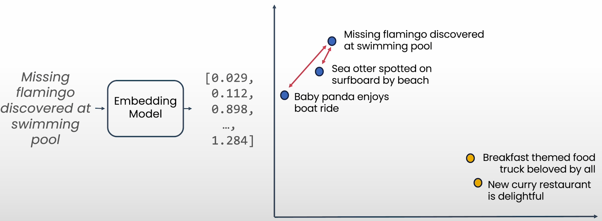

# Understanding and Applying Text Embeddings

# What is an embedding

A way of representing data as points in space where the locations are semantically meaningful



# How are sentence embeddings computed?

- Simple method: Embed each word separately, and take a sum or mean of all the word embeddings.
- Modern Embeddings:
    - Use a transformer neural network to compute a context-aware representation of each word, then take an average of the context-aware representations.
    - Compute embeddings for each token (e.g. sub-word) rather than word. Enabled algorithm to work even for novel words and misspelt words (”Life, the universe and everything”)
- Training the transformer network (contrastive learning):
    - Given a dataset of pairs of “similar” sentences, tune neural network to move similar sentences embeddings together, and dissimilar sentences embeddings apart.

## Applications

- Classification
- Clustering
- Outlier detection
- Semantic search
- Recommendation

# Generating text

```python
from vertexai.language_models import TextGenerationModel
# Select Model
generation_model = TextGenerationModel.from_pretrained("text-bison@001")

# Get prompt
prompt = "Recommended me a programming activity to improve mi skills"

# Generate answer
generation_model.predict(prompt= prompt)

```

In addition, to do PROMPT ENGINEERING. 

## Decoding strategies

Text input → probabilities over tokens

<aside>
🔥 Depending on the tokenization strategy we may get probability for words or substrings

</aside>

## GreedyDecoding

- **Greedy decoding**: The one with the highest probability
    - This may bring problems due to same word being repetitive.

## Random Sample: temperature

- **Random sample:** Use the probabilities to sample a random taken
    - One technique here is **TEMPERATURE**
        - High temperature values for open questions

In practice we can use **logits** and apply softmax in to it. 


A good rule of thump is starting with a temperature of 0.2. Below there is graph showing intuition on the values of the temperature depending on probability of words


## Top k/Top p

**Top k:** Sample from tokens with the top k probabilities.

- It works well when the k values are even.
- May give very odd results when the probabilities are very skew and we pick a low probability answer.

**Top p**: Sample from minimum set of tokens whose cumulative probability is greater or equal to P

## Mix of decoding strategies

One idea is using a  mix of the ideas above


**Example**:

```python
response = generation_model.predict(
	prompt = prompt,
	temperature = 0.5,
	top_k = 10,
	top_p = 0.9
)
```

# Building a Q&A System Using Semantic Search

Out-of-the-box LLMs aren’t connected to the real world

**GOAL**: Answer specific answers. 

**Challenge:** Response would depend on the knowledge cut-off

Grounding LLMs:

- Access information outside of training data
- Integrate with existing IT systems, databases, and business data
- Mitigate risk of hallucinations

<aside>
🔥 If you have the documents you do not need to retrain the model. We can use **Semantic Search**

</aside>


## Similarity Metrics

Possible similarity metrics

- Euclidean Distance (L2 Distance)
- Cosine Similarity
- Dot Product


The main idea is that we will be computing the cosine similarity of the question with every other question on our database.

## Scaling with approximate nearest neighbor search

Exhaustive search over a collection of embedding vector is infeasible for large datasets.

Instead, use algorithms that perform approximate matches.

ScaNN (Scalable Nearest Neighbors) is a method for efficient vector similarity search at scale.

[](https://github.com/google-research/google-research/tree/master/scann)

## Architecture

