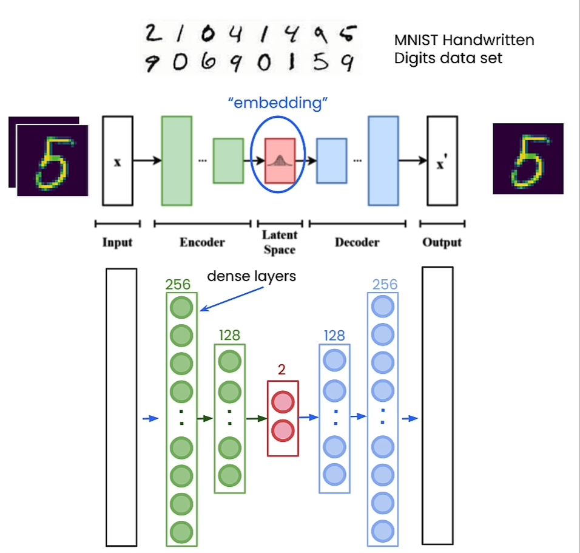

# Vector Databases: from Embeddings to Applications

The idea of this course is to work with embeddings of documents and vector database. Understanding how to use Sparce, Dense and Hybrid embeddings and apply them on Hybrid Search.

The goal of the course is to get all fundamentals to apply RAG (Retrieval Augmented Generation) and create an Multilingual Search application.

**Outline**

- How to obtain vector representations of data?
    - Embeddings
- Searching for Similar Vectors
    - Distance Metrics
- Approximate Nearest Neighbors
    - ANN - Trade recall for accuracy
    - HNSW
- Vector DB’s
    - CRUD operations
    - Objects + Vectors
    - Inverted Index - filtered search
- Sparse vs Dense Search
    - ANN search overt Dense embeddings
    - Sparse search
    - Hybrid search
- Applications of Vector DBs in Industry
    - Create RAG system for search system
    - Add Multilingual functionality

# How to Obtain Vector Representations of Data

## Creating Embeddings

We use a simple architecture for the embedding model. In reality the embedding layer have more neurons than this. 

- Vector embeddings **capture meaning**
- Vector embeddings ⇒ “machine understandable format of the data”

We will be using Tensorflow for the embedding model.

- Load MNIS data
- Normalize and reshape images (flatten)
- Define Neural Parameters. i.e. Batch Size, # epochs, # hidden layers, and # objective (embedding)
- Sampling function
- Encoder, Normalize data, Decoder
- Use variational autoencoder (VAE) to reconstruction input
- Train model
- Build encoder (flat encoder) for visualization

## More advance embeddings

It is important to also notice we can use more advanced models based on Transformer architecture to create embedding.

For example, we can use Sentence Transformer using **paraphrase-MiniLM-L6-v2** model to create embeddings or sentences

## Similarity metrics

There are 4 classic distance metrics

- Euclidean Distance (L2)
- Manhattan Distance (L1)
- **Dot Product**
- **Cosine Distance**

The most common similarity distance is the cosine distance. The idea is that very similar distances will have a very small angle between them. 

# Search for Similar Vectors

Semantic Search also known as vector search

There are a few ways to find the **K**-nearest neighbors.

- Brute Force: This is basically a kNN implementation
    - Find the distance of the query and ALL vectors.
    - Sort the distances
    - Find the top k matches
    - Time complexity: **O(n)**

# Weaviate

Weaviate is an opensource vector database. [https://weaviate.io/](https://weaviate.io/)

- Create Client with embedded options
- Create Schema dictionary
- Create schema on weaviate
- Load data
- Add embeddings into database by batches
- Get query
- Obtain closest objects closest to the query

It is important to notice that weaviate allow direct connection with LLM providers like OpenAI. Hence, we can create a client with a openAI key and then weaviate will handle the communication with OpenAI to create embeddings of our metadata directly.

- Weaviate supports CRUD operations
    - Create
    - Read
    - Update
    - Delete

# Dense, Sparse, and Hybrid Search

## Dense Search (Semantic Search)

- Uses vector embedding representation of data to perform search.
- This types of search allows one to capture and return semantically similar objects
- **Out of Domain Data problem:** the NN is as good as the data it was trained on. Hence, it will provide poor accuracy on out of domain problems.
- **Product with a Serial Number:** Searching for seemingly  random data will also yield poor results.

For the last reason, doing string or word matching could be inefficient with Dense Search. Hence we would be better off doing exact string or word matching to see where which product has the same serial number as the input serial number.

## Sparse Search (Key/Word Search)

- The text is embedded into vectors by counting how many times every unique word in your vocabulary occurs in the query and stored sentences.
- **Mostly Zeros aka Sparse Embedding:** The like hood of any given sentence containing every word in your vocabulary is quire low the embeddings is mostly zeroes and thus is known as a sparse embedding.

**Bag of words:** The easiest way to do keyword matching is using Bag of Words - to count how many times a word occurs in the query and the data vector and then return objects with the highest matching word frequencies.

 

Example:

**Best matching 25 (BM25):** In practice when performing keyword search we use a modification of simple word frequencies called best matching 25.

## Hybrid Search

### What is Hybrid Search?

Hybrid search is the process of performing both vector/dense search and keyword/sparse search and then combining the results

### Combination based on a Scoring System

This combination can be done based on a scoring system that measures how well each objects matches the query using both dense and sparse search

# Applications - Multilingual Search

Multilingual Search: Embedding produces vectors that convey **meaning**, vectors for the same phrase in different languages produces similar results.

## Retrieval Augmented Generation (RAG)

- Using a Vector database as an external knowledge base
    - Enable a large language model (LLM) to leverage a vector database as an external knowledge base of factual information
- Retrieve Relevant Info and provide to LLM
    - Improve a LLM by enabling it to retrieve relevant source material from the vector database and read it as part of the prompt prior to generating an answer to the prompt
- Synergized with a Vector Database
    - Vector databases can be queried for concepts using natural language
- Better to do RAG
    - Performing RAG is a lot more practical than having the LLM attend over its trained knowledge base
- Example: Vising a Library
    - It is asking to a human visiting a library and checking out and reading source material and books prior to writing a well thought out response to a question.

## Advantages of RAG

- **Reduce hallucinations**
- **Enable a LLM to cite sources**
- **Solve knowledge intensive tasks**

## RAG Workflow

1. Query a vector database
2. Obtain relevant source objects
3. Stuff the objects into the prompt
4. Send the modified prompt to the LLM to generate an answer

